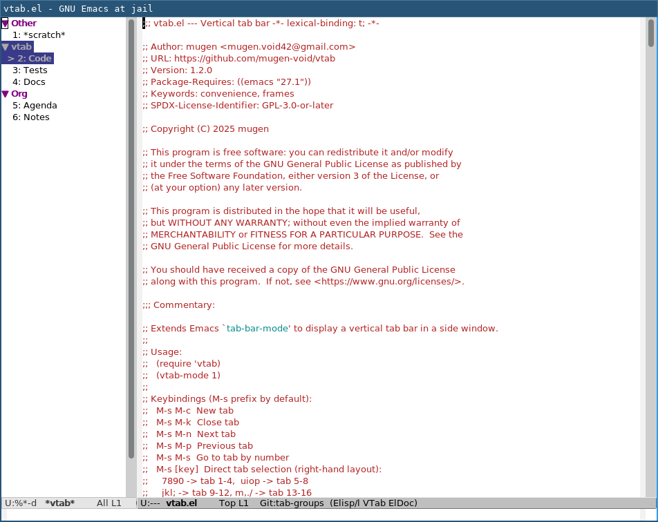
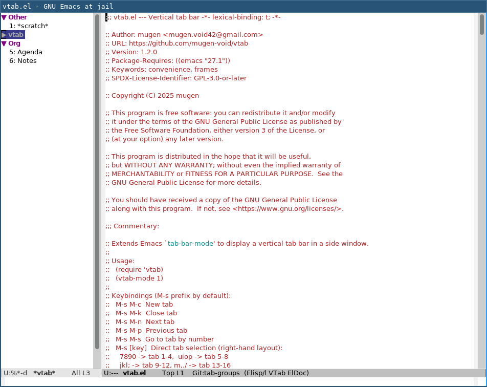
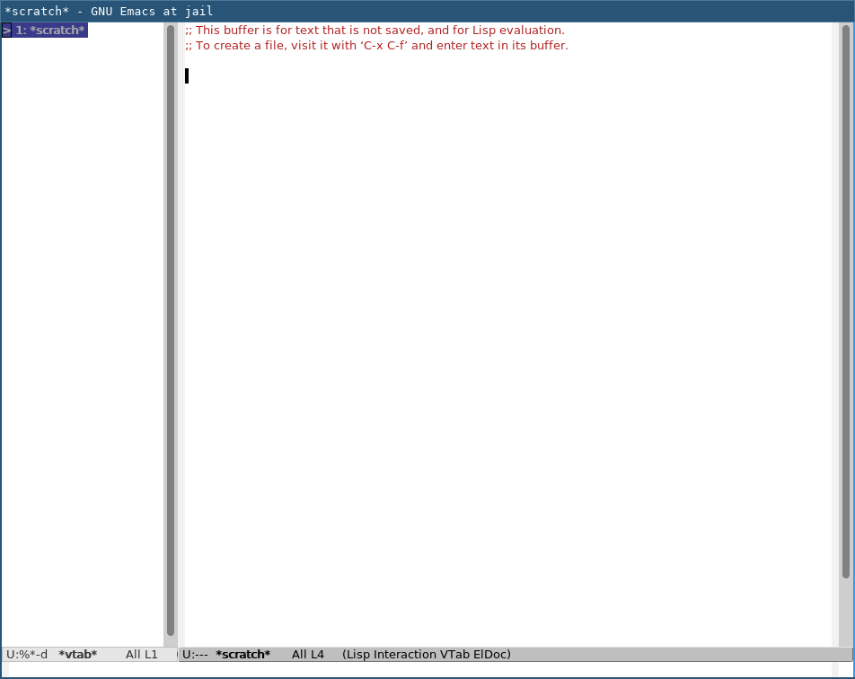
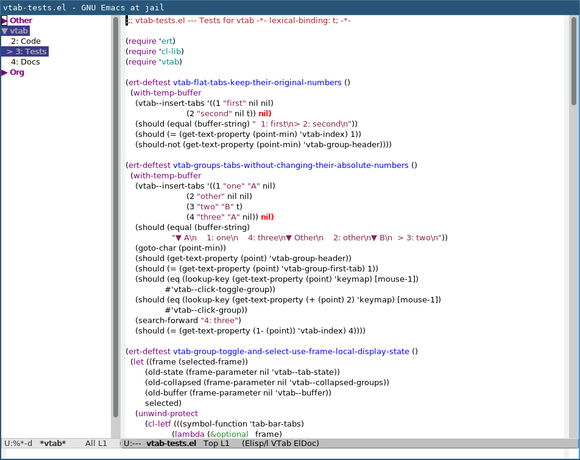

# vtab

A minor-mode package that extends Emacs `tab-bar-mode` to display a vertical tab bar in a side window.

<!-- Screenshot placeholder -->
<!--  -->


## screenshot


## Features

- Vertical tab bar in a dedicated side window (left or right)
- Click or keyboard to switch tabs
- Direct tab selection with customizable key sequences
- Native `tab-bar` groups with collapsible headers (Emacs 28.1+)
- `M-x customize` support for display settings
- Clean enable/disable: restores original settings when disabled
- Protected side window (`C-x o` skips it, `C-x 1` preserves it)

## Installation

### From MELPA

`M-x package-install RET vtab RET`

```elisp
(require 'vtab)
(vtab-mode 1)
```

### With use-package

```elisp
(use-package vtab
  :ensure t
  :config
  (vtab-mode 1))
```

## Usage

```elisp
(vtab-mode 1)   ; enable
(vtab-mode -1)  ; disable
(customize-group 'vtab)  ; settings UI
```

## Keybindings

Default prefix: `M-s`

| Key | Action |
|-----|--------|
| `M-s M-c` | New tab |
| `M-s M-k` | Close tab |
| `M-s M-n` | Next tab |
| `M-s M-p` | Previous tab |
| `M-s M-s` | Go to tab by number |

Direct tab selection (right-hand home row layout):

| Keys | Tabs |
|------|------|
| `M-s 7/8/9/0` | Tab 1-4 |
| `M-s u/i/o/p` | Tab 5-8 |
| `M-s j/k/l/;` | Tab 9-12 |
| `M-s m/,/./` | Tab 13-16 |

## Tab groups

On Emacs 28.1+, `vtab` displays the native `tab-bar` group of each tab.
Assign a group with `C-x t G` (`tab-group`). New tabs inherit the current
group when `tab-bar-new-tab-group` is `t` (the default on current Emacs).
Tabs without a group appear under a display-only **Other** header when groups
exist. If there are no groups, the familiar flat tab list is shown. Tab
numbers always refer to their absolute positions, including when a group is
collapsed.

On a group header, press `TAB` or click the arrow to collapse/expand it. Press
`RET` or click the group name to expand it and select its first tab. Collapse
state belongs to the frame's `vtab` display; it does not alter the tabs or
their groups. Native tab groups cannot exist without any tabs.

For one group per `project.el` project, `vtab` can be used with
[`project-tab-groups`](https://github.com/fritzgrabo/project-tab-groups):

```elisp
(use-package project-tab-groups
  :ensure t
  :config
  (project-tab-groups-mode 1))
```

Use `C-x p p` to switch projects and `C-x p k` to kill project buffers and
close its group's tabs. `vtab` only displays the resulting native groups;
`project-tab-groups` is optional. The package requires Emacs 28.1+, while
`vtab` continues to work as a flat tab list on Emacs 27.1.

| Expanded groups | Collapsed project group |
|---|---|
|  |  |
| No groups (flat list) | Project group with tabs; other groups collapsed |
|  |  |

## Customization

| Variable | Default | Description |
|----------|---------|-------------|
| `vtab-side` | `'left` | Display side (`left` / `right`) |
| `vtab-window-width` | `25` | Side window width |
| `vtab-new-tab-position` | `'rightmost` | `rightmost` / `leftmost` / `right` / `left` |
| `vtab-new-tab-choice` | `"*scratch*"` | Initial buffer for new tabs |
| `vtab-style-window-divider` | `t` | Set window-divider to 1px thin line |
| `vtab-style-fringe` | `t` | Make fringe background transparent |

Keybindings can be customized via `define-key`:

```elisp
;; Use C-x t prefix instead of M-s
(define-key vtab-mode-map (kbd "C-x t c") #'tab-new)
(define-key vtab-mode-map (kbd "C-x t k") #'tab-close)
(define-key vtab-mode-map (kbd "C-x t n") #'tab-next)
(define-key vtab-mode-map (kbd "C-x t p") #'tab-previous)
(define-key vtab-mode-map (kbd "C-x t g") #'vtab-goto-tab)
```

<details>
<summary>Development</summary>

### Test

```bash
emacs -Q --batch -L . -l tests/vtab-tests.el -f ert-run-tests-batch-and-exit
```

### Byte compile

```bash
emacs -batch -f batch-byte-compile vtab.el
```

</details>

---

**Requires:** Emacs 27.1+ | **License:** GPL-3.0-or-later

Built with [Claude Code](https://claude.ai/code)
